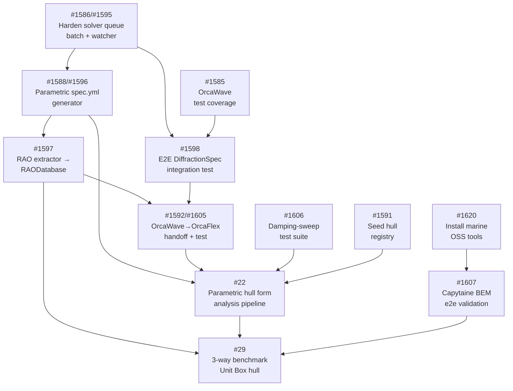

# OrcaWave / OrcaFlex — Domain Capability Roadmap

Note: for current operator navigation across code, tests, issues, and machine boundaries, start with `docs/maps/digitalmodel-orcawave-orcaflex-operator-map.md` (#1752). This roadmap remains useful for sequencing, but some implementation details may lag current repo state.

Auto-generated: 2026-04-02. Related: GitHub issue #1572.

## Executive Summary

The workspace-hub has a substantial OrcaWave/OrcaFlex integration spanning
**27+ source files** across two dedicated packages, a **git-based solver queue**,
a **20-module hull library**, and **101 spec.yml model templates**. The individual
components are well-implemented but integration points and test coverage are the
primary gaps. The critical path runs through solver queue hardening → parametric
spec generation → RAO extraction → OrcaWave-to-OrcaFlex handoff.

---

## 1. Current Capabilities

### 1.1 OrcaWave Package (13 source files)

Full frequency-domain diffraction analysis reporting pipeline:

| File | Capability |
|------|-----------|
| `orcawave/__init__.py` | Package entry point |
| `orcawave/reporting/__init__.py` | Public API: `generate_orcawave_report()` |
| `orcawave/reporting/config.py` | Pydantic-based report config with 8 section toggles |
| `orcawave/reporting/builder.py` | Orchestrates all sections into Bootstrap 5 + Plotly HTML |
| `orcawave/reporting/sections/model_summary.py` | Section 1: body count, period/heading range, water depth |
| `orcawave/reporting/sections/rao_plots.py` | Section 2: interactive RAO plots per DOF (surge through yaw) |
| `orcawave/reporting/sections/hydro_matrices.py` | Section 3: added mass + radiation damping diagonal plots |
| `orcawave/reporting/sections/mean_drift.py` | Section 4: mean drift table + polar plot |
| `orcawave/reporting/sections/panel_pressures.py` | Section 5: panel geometry summary + pressure output status |
| `orcawave/reporting/sections/multi_body.py` | Section 6: multi-body coupling matrix heatmap |
| `orcawave/reporting/sections/qtf_heatmap.py` | Section 7: QTF frequency-pair magnitude heatmap |
| `orcawave/reporting/sections/qa_summary.py` | Section 8: 4 automated QA checks (RAOs finite, added mass finite, damping non-negative, heave quasi-static) |

**Status**: Fully functional reporting when OrcFxAPI is available. Loads `.owr`
result files, generates self-contained HTML reports with interactive charts.

### 1.2 OrcaFlex Package (14 source files)

Full time-domain simulation reporting pipeline:

| File | Capability |
|------|-----------|
| `orcaflex/__init__.py` | Package entry point: `generate_orcaflex_report`, `run_orcaflex_qa` |
| `orcaflex/qa.py` | QA facade — dynamically loads example QA module |
| `orcaflex/reporting/__init__.py` | Public API: `generate_orcaflex_report()` |
| `orcaflex/reporting/config.py` | Report config with 8 sections (code check, mooring, modal disabled by default) |
| `orcaflex/reporting/builder.py` | HTML builder from `.sim` files, supports `ORCAFLEX_API_PATH` env var |
| `orcaflex/reporting/sections/model_summary.py` | Section 1: object counts, environment, analysis type |
| `orcaflex/reporting/sections/static_config.py` | Section 2: static tensions, vessel positions |
| `orcaflex/reporting/sections/time_series.py` | Section 3: dynamic time series (vessel DOFs, line tensions) |
| `orcaflex/reporting/sections/range_graphs.py` | Section 4: arclength vs min/max envelope for tension and bending |
| `orcaflex/reporting/sections/code_check.py` | Section 5: code check utilization table |
| `orcaflex/reporting/sections/mooring_loads.py` | Section 6: fairlead tensions and watch circle |
| `orcaflex/reporting/sections/modal_analysis.py` | Section 7: natural frequencies and mode shapes |
| `orcaflex/reporting/sections/qa_summary.py` | Section 8: QA pass/fail from example JSON results |

**Status**: Fully functional reporting. Loads `.sim` files via OrcFxAPI.

### 1.3 Solver Queue (`scripts/solver/process-queue.py`)

Git-integrated job dispatch for licensed Windows machine:
- Reads YAML job files from `queue/pending/`
- Runs OrcaWave (`.owd` → `.owr`) or OrcaFlex (`.dat` → `.sim`)
- Moves results to `queue/completed/` or `queue/failed/`
- Git commit + push after each job
- Designed for Task Scheduler (30-min polling)

**Status**: Operational — 1 successful OrcaWave run. Single-job processing only
(no batch submission or result watching).

### 1.4 Hull Library (20+ modules)

Comprehensive hull form library under `digitalmodel/src/digitalmodel/hydrodynamics/hull_library/`:

| Module | Capability |
|--------|-----------|
| `rao_database.py` | RAO database with Parquet persistence, parameter-range queries |
| `catalog.py` | Full spectral analysis: S_response = \|RAO(ω)\|² × S_wave(ω), point accelerations |
| `analysis_setup.py` | Single-call skill: target dimensions → (scaled mesh, RAO data) |
| `mesh_generator.py` | Panel mesh from hull line profiles, curvature-adaptive panels |
| `parametric_hull.py` | Cartesian-product hull variation generator for batch RAO sweeps |
| `lookup.py` | Nearest-neighbour hull form matching with 8 built-in fallback hulls |

**Status**: Core algorithms implemented. Integration with solver queue untested.

### 1.5 Spec.yml Templates (101 files)

Located under `digitalmodel/docs/domains/orcaflex/`:
- **60+ model library** entries: risers (catenary, lazy wave, pliant wave, steep wave),
  drilling, mooring (turret, SPM, CALM), fish farms, ROV/umbilicals, cranes, pipelines
- **Installation scenarios**: floating and S-lay pipeline installation
- **Jumper models**: manifold-to-PLET, SUTs
- **Training and reference** configurations

**Status**: Mature template library. Serves as input for modular OrcaFlex model generation.

---

## 2. Known Gaps (Mapped from Open Issues)

### 2.1 Critical Path — Pipeline Integration

| # | Issue | Gap | Priority |
|---|-------|-----|----------|
| #1586 | Harden solver queue: batch submission, result watcher | Only single-job processing, no monitoring | HIGH |
| #1595 | Batch submission + result watcher scripts | No `submit-batch.sh` or `watch-results.sh` | HIGH |
| #1588 | Parametric spec.yml generator | No bridge from hull_library → DiffractionSpec | HIGH |
| #1596 | DiffractionSpec-compliant spec files from sweep defs | Cross-checks against L00/L02/L03 references missing | HIGH |
| #1597 | RAO extractor → RAODatabase population | `.owr` results not flowing into RAODatabase (Parquet) | HIGH |
| #1598 | End-to-end DiffractionSpec pipeline integration test | 37 test files exist but none test full pipeline | HIGH |
| #1592 | OrcaWave → OrcaFlex handoff automation | Manual workflow for RAO extraction → vessel type gen | MEDIUM |
| #1605 | OrcaWave-to-OrcaFlex integration test | No validation of RAO export + coordinate transforms | MEDIUM |

### 2.2 Test Coverage Gaps

| # | Issue | Gap | Priority |
|---|-------|-----|----------|
| #1585 | OrcaWave package: 13 source files, 0 tests | Zero unit test coverage for entire orcawave package | HIGH |
| #1606 | Damping-sweep test suite | DampingSweep, CriticalDampingCalculator code exists, ZERO tests | MEDIUM |
| #1599 | Parametric hull analysis tests | forward_speed, shallow_water, passing_ship untested | MEDIUM |
| #1601 | parametric_hull_analysis tests | Additional test scenarios needed | MEDIUM |

### 2.3 Solver Ecosystem Expansion

| # | Issue | Gap | Priority |
|---|-------|-----|----------|
| #1607 | Capytaine BEM e2e integration | Code exists (316 lines) but no validated run | HIGH |
| #1440 | Install Capytaine into ACE ecosystem | Dependency installation on dev-secondary | MEDIUM |
| #1593 | Automated WAMIT validation runner | L00 test cases need validation infrastructure | LOW |
| #1620 | Clone+install BEMRosetta, pyHAMS, OCEANLYZ, wavespectra | Critical marine OSS dependencies | HIGH |

### 2.4 Engineering Analysis Expansion

| # | Issue | Gap | Priority |
|---|-------|-----|----------|
| #22 | Parametric hull form analysis with RAO generation | End-to-end parametric pipeline | HIGH |
| #29 | 3-way benchmark on Unit Box hull | Cross-validation (AQWA vs OrcaFlex vs Capytaine) | HIGH |
| #1264 | OrcaFlex frame analysis (static) | Parachute frame static load analysis | HIGH |
| #1292 | OrcaFlex parachute deployment — snap load analysis | Dynamic snap load template | LOW |
| #1591 | Seed hull registry with standard hull forms | Barge, tanker, semi-sub, spar, FPSO entries | MEDIUM |
| #1594 | DLC matrix generator for mooring/riser analysis | Design Load Case matrix missing | LOW |
| #21 | SPM project benchmarking — AQWA vs OrcaFlex | Cross-tool comparison framework | MEDIUM |

---

## 3. Dependency Chain



### Critical Path (serialized)

```
#1586/#1595 (solver queue hardening)
    → #1588/#1596 (parametric spec.yml generator)
        → #1597 (RAO extractor + database population)
            → #1598 (e2e pipeline integration test)
                → #1592/#1605 (OrcaWave→OrcaFlex handoff)
                    → #22 (full parametric hull form pipeline)
                        → #29 (3-way benchmark validation)
```

---

## 4. Recommended Priority Order

### Phase 1 — Near-Term (1-2 weeks): Solver Queue + Test Foundation

| Priority | Issue(s) | Deliverable | Effort |
|----------|----------|-------------|--------|
| 1 | #1586, #1595 | `submit-batch.sh`, `watch-results.sh`, health monitoring | 2-3 days |
| 2 | #1585 | Unit tests for all 13 orcawave source files | 2-3 days |
| 3 | #1620 | Install BEMRosetta, pyHAMS, OCEANLYZ, wavespectra on dev machines | 1 day |

**Rationale**: The solver queue is the single point of failure. Without batch
submission and result watching, no parametric work can proceed. Test coverage
for orcawave is foundational — it de-risks all downstream changes.

### Phase 2 — Near-Term (2-4 weeks): Parametric Pipeline

| Priority | Issue(s) | Deliverable | Effort |
|----------|----------|-------------|--------|
| 4 | #1588, #1596 | `parametric_spec_generator.py`: sweep YAML → N validated spec.yml | 3-4 days |
| 5 | #1597 | `OrcaWaveResultExtractor` class, RAODatabase population, comparison plots | 3-4 days |
| 6 | #1598 | E2E integration test: spec.yml → validation → backend → solver → extraction | 2-3 days |
| 7 | #1591 | Seed hull_registry.yaml with standard hull forms | 1-2 days |

**Rationale**: These form the automated pipeline from hull definition through
to RAO storage. Each step builds on the previous.

### Phase 3 — Medium-Term (1-2 months): Cross-Solver Integration

| Priority | Issue(s) | Deliverable | Effort |
|----------|----------|-------------|--------|
| 8 | #1592, #1605 | OrcaWave→OrcaFlex handoff automation + integration test | 3-5 days |
| 9 | #1606 | Damping-sweep test suite with known analytical solutions | 2-3 days |
| 10 | #1607 | Capytaine BEM 3-hull parametric sweep validation | 3-4 days |
| 11 | #22 | Full parametric hull form analysis pipeline | 1-2 weeks |
| 12 | #1264 | OrcaFlex static frame analysis template | 2-3 days |

**Rationale**: With the pipeline proven end-to-end, these tasks build out
the engineering analysis breadth and cross-validate with open-source solvers.

### Phase 4 — Long-Term (3-6 months): Validation + Scale

| Priority | Issue(s) | Deliverable | Effort |
|----------|----------|-------------|--------|
| 13 | #29 | 3-way benchmark (AQWA vs OrcaFlex vs Capytaine) on Unit Box hull | 1-2 weeks |
| 14 | #21 | SPM benchmarking — AQWA vs OrcaFlex cross-validation | 1-2 weeks |
| 15 | #1593 | Automated WAMIT validation runner for L00 test cases | 1 week |
| 16 | #1594 | DLC matrix generator for mooring/riser analysis | 1-2 weeks |
| 17 | #1292 | OrcaFlex parachute deployment — dynamic snap load analysis | 1 week |
| 18 | #1599, #1601 | Parametric hull tests: forward_speed, shallow_water, passing_ship | 1 week |

**Rationale**: These require the full pipeline to be operational and validated.
Benchmark work is high-value for engineering credibility but needs stable tooling.

---

## 5. Risk Assessment

| Risk | Likelihood | Impact | Mitigation |
|------|-----------|--------|------------|
| OrcFxAPI license availability | Medium | High | Capytaine (#1607) as open-source fallback |
| Windows solver machine downtime | Medium | High | Health monitoring in #1586; batch retry logic |
| Hull library → solver format mismatch | Low | Medium | Integration test #1598 catches early |
| RAO coordinate transform errors | Medium | High | Tolerance-based validation in #1605 |
| Capytaine vs OrcaWave result divergence | Medium | Medium | 3-way benchmark #29 quantifies differences |

---

## 6. Source File Reference Index

### OrcaWave (13 files)
1. `digitalmodel/src/digitalmodel/orcawave/__init__.py`
2. `digitalmodel/src/digitalmodel/orcawave/reporting/__init__.py`
3. `digitalmodel/src/digitalmodel/orcawave/reporting/config.py`
4. `digitalmodel/src/digitalmodel/orcawave/reporting/builder.py`
5. `digitalmodel/src/digitalmodel/orcawave/reporting/sections/__init__.py`
6. `digitalmodel/src/digitalmodel/orcawave/reporting/sections/model_summary.py`
7. `digitalmodel/src/digitalmodel/orcawave/reporting/sections/rao_plots.py`
8. `digitalmodel/src/digitalmodel/orcawave/reporting/sections/hydro_matrices.py`
9. `digitalmodel/src/digitalmodel/orcawave/reporting/sections/mean_drift.py`
10. `digitalmodel/src/digitalmodel/orcawave/reporting/sections/panel_pressures.py`
11. `digitalmodel/src/digitalmodel/orcawave/reporting/sections/multi_body.py`
12. `digitalmodel/src/digitalmodel/orcawave/reporting/sections/qtf_heatmap.py`
13. `digitalmodel/src/digitalmodel/orcawave/reporting/sections/qa_summary.py`

### OrcaFlex (14 files)
14. `digitalmodel/src/digitalmodel/orcaflex/__init__.py`
15. `digitalmodel/src/digitalmodel/orcaflex/qa.py`
16. `digitalmodel/src/digitalmodel/orcaflex/reporting/__init__.py`
17. `digitalmodel/src/digitalmodel/orcaflex/reporting/config.py`
18. `digitalmodel/src/digitalmodel/orcaflex/reporting/builder.py`
19. `digitalmodel/src/digitalmodel/orcaflex/reporting/sections/model_summary.py`
20. `digitalmodel/src/digitalmodel/orcaflex/reporting/sections/static_config.py`
21. `digitalmodel/src/digitalmodel/orcaflex/reporting/sections/time_series.py`
22. `digitalmodel/src/digitalmodel/orcaflex/reporting/sections/range_graphs.py`
23. `digitalmodel/src/digitalmodel/orcaflex/reporting/sections/code_check.py`
24. `digitalmodel/src/digitalmodel/orcaflex/reporting/sections/mooring_loads.py`
25. `digitalmodel/src/digitalmodel/orcaflex/reporting/sections/modal_analysis.py`
26. `digitalmodel/src/digitalmodel/orcaflex/reporting/sections/qa_summary.py`

### Solver Queue
27. `scripts/solver/process-queue.py`

### Hull Library (key modules)
28. `digitalmodel/src/digitalmodel/hydrodynamics/hull_library/rao_database.py`
29. `digitalmodel/src/digitalmodel/hydrodynamics/hull_library/catalog.py`
30. `digitalmodel/src/digitalmodel/hydrodynamics/hull_library/analysis_setup.py`
31. `digitalmodel/src/digitalmodel/hydrodynamics/hull_library/mesh_generator.py`
32. `digitalmodel/src/digitalmodel/hydrodynamics/hull_library/parametric_hull.py`
33. `digitalmodel/src/digitalmodel/hydrodynamics/hull_library/lookup.py`
